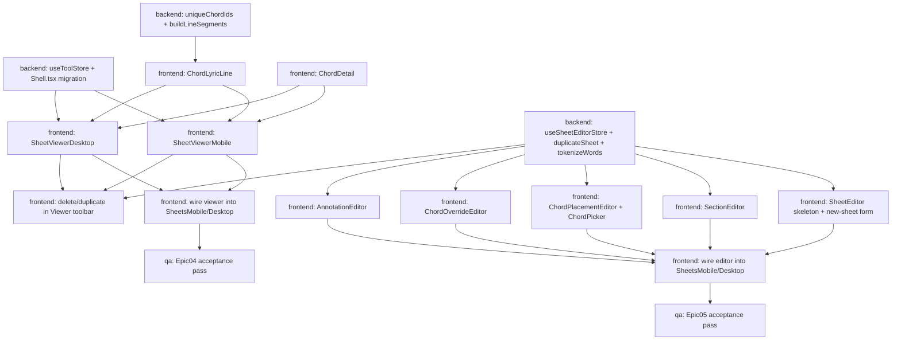

# Sheets — Task Breakdown v2 (Epics 04–05)

ICD: [`docs/planning/sheets-icd-v2.md`](./sheets-icd-v2.md) — read that
first (and [`sheets-icd.md`](./sheets-icd.md) behind it for Epics 01–03's
contracts, which this breakdown assumes are already shipped on
`feature/t3bcd-sheets-ui`). This file assumes v2's type/store/component
contracts as given.

Source note: same as v1 — the roadmap artifact URL could not be fetched
in this environment. This breakdown is built from the two epics'
descriptions as given directly in the task, `docs/DESIGN.md`, and the
current state of `feature/t3bcd-sheets-ui`. No separate discovery/UX pass
was run; the ICD's §9 assumptions (G–P) are where genuine ambiguity was
resolved rather than left as a gap — worth a human skim before dispatch,
same posture as v1.

Role mapping unchanged from v1: **backend-engineer** owns `src/lib/**`
(types, Zustand stores, chord/render math); **frontend-engineer** owns
`src/components/**` (and the two hook additions in `src/hooks/**`, which
are UI-adjacent, not data-layer). No devops or qa work is needed to *add*
new infra here (Vitest/CI already exist from `T0`) — qa-engineer tasks
below are acceptance passes only.

**Scope reminder**: nothing in this task list touches
`src/components/metronome/**`, `MetronomeMobile.tsx`, `MetronomeDesktop.tsx`,
`metronomeEngine.ts`, `MobileShell.tsx`, `SetlistList.tsx`, or
`useSwipeReveal.ts` — the ICD's tool-switching design (§2) was
specifically chosen so `MobileShell.tsx`/`DesktopShell.tsx`'s prop
signatures don't need to change at all.

## Task list

### Epic 04 — Sheet viewer

| ID | Description | Role | Files | Depends on |
| --- | --- | --- | --- | --- |
| T4a | `useToolStore` (tool/setTool) in `store.ts`; migrate `Shell.tsx` from local `useState` to this store (ICD §2) | backend-engineer | `src/lib/store.ts`, `src/components/shell/Shell.tsx` | none |
| T4b | `uniqueChordIds` (`chords.ts`) + `buildLineSegments` (`store.ts`) pure helpers, with unit tests covering the worked examples in ICD §3.1–3.2 (incl. the highlight-spanning-a-chord-boundary case) | backend-engineer | `src/lib/chords.ts`, `src/lib/store.ts`, `src/lib/__tests__/chords.test.ts` (extend), `src/lib/__tests__/sheetsRendering.test.ts` (new) | none |
| T4c | `ChordLyricLine.tsx` — renders one `Line` via `buildLineSegments` + `resolveChordDisplay`; absolutely-positioned chord labels, highlighted-segment styling, tappable chords (`onChordTap` callback prop) | frontend-engineer | `src/components/sheets/ChordLyricLine.tsx` | T4b |
| T4d | `ChordDetail.tsx` — guitar string readout (high-to-low display order per ICD §4.1) + piano voicing strip + `"CHORD NOT RECOGNIZED"` fallback for `resolvedFrom === "unknown"` | frontend-engineer | `src/components/sheets/ChordDetail.tsx` | none (Epic 02's `resolveChordDisplay` is already shipped) |
| T4e | `SheetViewerMobile.tsx` + `useAutoscroll.ts` hook — header, chord chips, section jump nav, body (`ChordLyricLine` per line + note-annotation margin blocks), chord tap → `ChordDetail` panel, "SEND TO METRONOME" button (ICD §2), autoscroll (ICD §5.6), and all states in ICD §5.8 | frontend-engineer | `src/components/sheets/SheetViewerMobile.tsx`, `src/hooks/useAutoscroll.ts` | T4a, T4c, T4d |
| T4f | `SheetViewerDesktop.tsx` — same feature set as T4e, two-column verse/chorus layout + right panel (chord chips/tablature/piano/transpose row) per `docs/DESIGN.md`'s desktop chord-sheets spec | frontend-engineer | `src/components/sheets/SheetViewerDesktop.tsx` | T4a, T4c, T4d — **parallel to T4e** (separate file, same prerequisites) |
| T4g | Wire `SheetsMobile.tsx`/`SheetsDesktop.tsx`'s `"viewer"` branch to `SheetViewerMobile`/`SheetViewerDesktop`, replacing `Placeholder` | frontend-engineer | `src/components/sheets/SheetsMobile.tsx`, `src/components/sheets/SheetsDesktop.tsx` | T4e, T4f |
| T4h | Verify Epic 04 acceptance criteria + ICD §5.8 states matrix (loading/not-found/empty/populated), chord tap → tab+piano incl. unknown-chord fallback, capo/transpose display reuses Epic 02's fixed worked examples correctly, section jump, both annotation types render, autoscroll toggle/speed/pause-resume, "Send to Metronome" pushes bpm+meter and switches tool without touching running/subdivision/accent/clickSound, mobile+desktop parity, regression check on `Shell.tsx` keyboard shortcuts and Tuner/Metronome tool-switching after the `useToolStore` migration | qa-engineer | none (verification only) | T4g |

### Epic 05 — Sheet editor

| ID | Description | Role | Files | Depends on |
| --- | --- | --- | --- | --- |
| T5a | `useSheetEditorStore` (full draft-editing API, ICD §6.1) + `duplicateSheet` added to `useSheetsStore` (ICD §6.10) + `tokenizeWords` (ICD §6.6) + `KNOWN_CHORD_IDS` export from `chords.ts` (ICD §6.4); unit tests for `duplicateSheet`'s id-regeneration rule, `setLineLyrics`'s clear-on-change rule (Assumption H), and `tokenizeWords`'s worked example | backend-engineer | `src/lib/store.ts`, `src/lib/chords.ts`, `src/lib/__tests__/sheetsStore.test.ts` (extend), `src/lib/__tests__/sheetsEditorStore.test.ts` (new) | none |
| T5b | New-sheet metadata form + editor screen skeletons (`SheetEditorMobile.tsx`/`SheetEditorDesktop.tsx`) — fields bound to `updateMeta`, `load(sheetId)` on mount, Save/Cancel wired per ICD §6.11, not-found/loading states per ICD §6.12 | frontend-engineer | `src/components/sheets/SheetEditorMobile.tsx`, `src/components/sheets/SheetEditorDesktop.tsx` | T5a |
| T5c | Section tagging UI — add/rename/remove sections, each with its lines list + "add line" affordance | frontend-engineer | `src/components/sheets/SectionEditor.tsx` | T5a — **parallel to T5b, T5d, T5e, T5f** |
| T5d | Chord-placement editor — per-line text/placement mode toggle, `tokenizeWords`-driven tap-a-word UI, `ChordPicker` (autocomplete against `KNOWN_CHORD_IDS` + freeform entry) per ICD §6.3–6.4. If `ChordLyricLine` (T4c) hasn't landed yet, ships with a simple inline preview and swaps to it in a small follow-up — not a hard dependency (ICD §7) | frontend-engineer | `src/components/sheets/ChordPlacementEditor.tsx`, `src/components/sheets/ChordPicker.tsx` | T5a |
| T5e | Chord voicing override editor — `uniqueChordIds`-driven (or inline fallback dedupe if T4b hasn't landed, same non-blocking note as T5d) chord list, constrained fret/piano-key pickers per ICD §6.7 (Assumption K) | frontend-engineer | `src/components/sheets/ChordOverrideEditor.tsx` | T5a |
| T5f | Annotation tools — note (line/section per Assumption J) + highlight (manual range select, and the "highlight this chord" shortcut per Assumption L) create/edit/remove UI | frontend-engineer | `src/components/sheets/AnnotationEditor.tsx` | T5a |
| T5g | Delete/duplicate actions in the Viewer toolbar (`window.confirm`-guarded delete, unguarded duplicate) per ICD §6.9 | frontend-engineer | `src/components/sheets/SheetViewerMobile.tsx`, `src/components/sheets/SheetViewerDesktop.tsx` | T5a, T4e, T4f — **the one deliberate cross-epic coupling; see dispatch guidance** |
| T5h | Wire `SheetsMobile.tsx`/`SheetsDesktop.tsx`'s `"editor"` branch to `SheetEditorMobile`/`SheetEditorDesktop`, composing T5c/T5d/T5e/T5f into the screen shell from T5b | frontend-engineer | `src/components/sheets/SheetsMobile.tsx`, `src/components/sheets/SheetsDesktop.tsx`, `src/components/sheets/SheetEditorMobile.tsx`, `src/components/sheets/SheetEditorDesktop.tsx` | T5b, T5c, T5d, T5e, T5f |
| T5i | Verify Epic 05 acceptance criteria + ICD §6.12 states matrix — new-sheet form, tap-word chord placement incl. autocomplete + freeform + correct `charIndex` on save, section tagging, override editor round-trips through `resolveChordDisplay`, both annotation types incl. the highlight-a-chord shortcut, delete (confirm-guarded) and duplicate (independent copy — mutating the copy doesn't touch the original, incl. its `Section`/`Annotation` ids), save→viewer / cancel→list-or-viewer navigation per §6.11, not-found state for a bad existing-sheet id, regression check on Shell/Tuner/Metronome | qa-engineer | none (verification only) | T5h |

## Dependency graph

## Dispatch guidance

1. **`T4a`, `T4b`, and `T5a` have no dependencies on each other or on
   any unbuilt work** — all three are backend-engineer tasks touching
   `src/lib/**` and can be dispatched together, same turn.
2. **Epic 04 and Epic 05 are genuinely parallel epics**, not just
   parallel within themselves — re-checking the task brief's premise
   (ICD v2 §7): no new store/lib addition either epic needs is shared
   with the other. Once `T4a`/`T4b`/`T5a` land, dispatch
   frontend-engineer on `T4c`+`T4d` (Epic 04) and `T5b`/`T5c`/`T5d`/
   `T5e`/`T5f` (Epic 05, five tasks that are themselves mutually
   parallel — five separate new files, one shared prerequisite `T5a`)
   **in the same batch**. This is a wider parallel front than v1's
   Epic 02/03 split.
3. **One exception, called out explicitly: `T4g` and `T5h` both edit
   `SheetsMobile.tsx`/`SheetsDesktop.tsx`.** Nothing about their content
   depends on the other, but dispatching them in the same turn against
   the same two files risks a real merge collision (unlike everything
   else in this plan, which touches disjoint files). Land `T4g` first
   (it only needs `T4e`+`T4f`, which are earlier in a typical build
   order since Epic 04 has fewer parallel sub-tasks than Epic 05), then
   `T5h` once `T5b`–`T5f` are all in — or the reverse order if Epic 05's
   five sub-tasks happen to finish first. Either order is fine; just not
   both at once.
4. **`T5g` is the one deliberate cross-epic dependency** — it adds
   delete/duplicate buttons to the *already-built* Viewer screens
   (ICD §6.9, Assumption P), so it necessarily waits on `T4e`+`T4f`
   (Epic 04's viewer components existing) in addition to `T5a`. Treat it
   as one of the last Epic 05 frontend tasks, not an early one, even
   though it's conceptually simple.
5. QA tasks (`T4h`, `T5i`) run after their own epic's build tasks land
   and `T4g`/`T5h` respectively are wired in; they can run in parallel
   with each other once both are unblocked, same as v1's QA tasks could.
6. Net effect: after the three backend tasks (`T4a`, `T4b`, `T5a`) land,
   this plan supports dispatching **seven frontend tasks in one batch**
   (`T4c`, `T4d`, `T5b`, `T5c`, `T5d`, `T5e`, `T5f`) before any
   sequential joins are needed — the ICD's job in this pass was mostly
   to confirm that Epic 04 and Epic 05 don't actually need to coordinate,
   not just to describe each epic's own internals.
