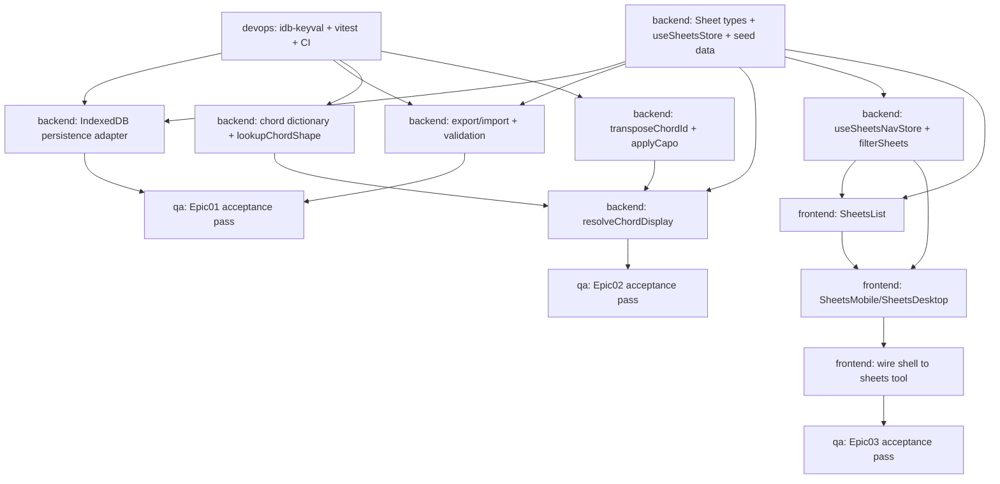

# Sheets — Task Breakdown (Epics 01–03)

ICD: [`docs/planning/sheets-icd.md`](./sheets-icd.md) — read that first; this
file assumes its type/function/store contracts as given.

Source note: the roadmap artifact linked in the task brief could not be
fetched in this environment (no network/browser tool available), so this
breakdown is built from the three epics' detailed descriptions as given
directly in the task, `docs/DESIGN.md` (existing Chord Sheets screen spec
+ sample content), and the current codebase. No separate discovery/UX
pass beyond that was run — flagged per process, though in this case the
epic descriptions were already detailed enough to plan against with
normal confidence; **Assumption A** in the ICD (keeping `Sheet` separate
from `Song`) is the one item most worth a human sanity-check against the
un-seen roadmap doc before backend-engineer starts.

Role mapping for this client-only app: **backend-engineer** owns
`src/lib/**` (types, Zustand stores, persistence, chord math — the
data/logic layer); **frontend-engineer** owns `src/components/**` (UI).
This mirrors the codebase's own existing split (`store.ts`/`music.ts`/
`metronomeEngine.ts` vs. `components/tuner`/`components/metronome`).

## Task list

### Epic 01 — Sheet data & local storage

| ID | Description | Role | Files | Depends on |
| --- | --- | --- | --- | --- |
| T1a | Add `Sheet`/`Section`/`Line`/`ChordOverride`/`Annotation`/`TimeSignature` types and `useSheetsStore` (in-memory only at this step — CRUD actions, 5 seed sheets incl. the full `DEAD AIR ON THE HIGHWAY` payload from ICD §5.1) | backend-engineer | `src/lib/store.ts` | none |
| T1b | IndexedDB persistence adapter wired via Zustand `persist`; adds `hydrated` and `persistenceError` to `useSheetsStore`; falls back to seed data on corrupt/unreadable storage instead of crashing (ICD §3.2, §3.4) | backend-engineer | `src/lib/sheetsPersistence.ts`, `src/lib/store.ts` (wiring), `package.json` (add `idb-keyval`) | T1a, T0 |
| T1c | Export/import: `exportSheet`, `exportLibrary`, `importFile` with full runtime validation and the fresh-id/append-only import rule (ICD §3.3); unit tests covering round-trip losslessness and the malformed-file case | backend-engineer | `src/lib/sheetsImportExport.ts` | T1a, T0 |
| T1d | Manual + browser-level acceptance pass: reload persistence actually survives a page refresh, export→import round-trips losslessly in a real browser (not just unit tests), simulated storage failure shows the non-blocking banner and doesn't crash, and Tuner/Metronome are unaffected by the `store.ts` edit (regression check on a shared file) | qa-engineer | none (verification only) | T1b, T1c |

### Epic 02 — Chord dictionary & voicing lookup

| ID | Description | Role | Files | Depends on |
| --- | --- | --- | --- | --- |
| T2a | Chord shape dictionary (power chords, open majors/minors/7ths per ICD §4.2's fixed table) + `lookupChordShape` with the explicit `"unknown"` fallback (never null-crash, never a blank diagram) | backend-engineer | `src/lib/chords.ts` | T0 (for tests); *no real dependency on T1a — this function doesn't touch `Sheet`/`ChordOverride` at all, see note below* |
| T2b | `transposeChordId` (chord-name pitch-shift, sharps-only respelling) + `applyCapo` (numeric fret-offset display math), with the two fixed worked-example unit tests from ICD §4.4 (`applyCapo` on open G + capo 2; `transposeChordId("E5", 2)`) | backend-engineer | `src/lib/chords.ts` | T0; *also no real dependency on T1a* |
| T2c | `resolveChordDisplay`: per-sheet override resolution (override-wins rule) composed with `lookupChordShape`/`transposeChordId`/`applyCapo` per ICD §4.3 | backend-engineer | `src/lib/chords.ts` | T1a (needs `ChordOverride`/`Sheet` types), T2a, T2b |
| T2d | Verify ICD §5.2–§5.4 sample payloads exactly, plus a short fuzz list of garbage chord names against `lookupChordShape`/`resolveChordDisplay` to confirm the fallback path never throws | qa-engineer | none (verification only) | T2c |

Note worth acting on: only **T2c** actually needs Epic 01's types — T2a
and T2b are pure string/array functions with zero dependency on `Sheet`.
If there's any schedule pressure, T2a/T2b can start immediately,
in parallel with T1a itself, not just "after Epic 01."

### Epic 03 — Sheets list screen

| ID | Description | Role | Files | Depends on |
| --- | --- | --- | --- | --- |
| T3a | `useSheetsNavStore` (list/viewer/editor sub-navigation, ICD §6) + `filterSheets` pure function (ICD §7) | backend-engineer | `src/lib/store.ts` | T1a |
| T3b | `SheetsList` component: title/key/bpm rows (reusing `SetlistList.tsx`'s row/variant pattern), search input wired to `filterSheets`, and all three required states — loading (`hydrated === false`), empty (`hydrated && sheets.length === 0`, with a prominent "+ New Sheet" CTA), populated | frontend-engineer | `src/components/sheets/SheetsList.tsx` | T1a, T3a |
| T3c | `SheetsMobile`/`SheetsDesktop`: render `SheetsList` for `{name:"list"}`; render the existing `Placeholder` + a "← SHEETS" back control for `"viewer"`/`"editor"`; wire row-tap → `openViewer(id)` and "+ New Sheet" → `openEditor(null)` | frontend-engineer | `src/components/sheets/SheetsMobile.tsx`, `src/components/sheets/SheetsDesktop.tsx` | T3a, T3b |
| T3d | Wire the `sheets` tool in the app shell to the new components instead of the generic `Placeholder` | frontend-engineer | `src/components/shell/MobileShell.tsx`, `src/components/shell/DesktopShell.tsx` | T3c |
| T3e | Verify: seed sheets render with correct title/key/bpm; search filters by title and by key; tap → viewer placeholder with working back button; "+ New Sheet" → editor placeholder; loading state is visible before hydration; empty state renders correctly once all sheets are removed; switching to another tool and back preserves the sub-screen; Tuner/Metronome navigation still works (regression on shared shell files) | qa-engineer | none (verification only) | T3d |

### Cross-cutting

| ID | Description | Role | Files | Depends on |
| --- | --- | --- | --- | --- |
| T0 | Add `idb-keyval` dependency; introduce a lightweight test runner (Vitest) with an `npm test` script and a CI step in `.github/workflows/ci.yml`, so the pure-logic modules across all three epics (chord math, import/export round-trip, capo worked example) can actually be pinned down as automated tests rather than doc-only claims | devops-engineer | `package.json`, `.github/workflows/ci.yml`, `vitest.config.ts` (new) | none |

## Dependency graph

## Dispatch guidance

1. **Land `T0` and `T1a` first** — both are small, low-ambiguity, and
   almost everything else either needs `T1a`'s types or `T0`'s test
   runner. They have no dependency on each other and should be dispatched
   together.
2. **Once `T1a` and `T0` land, dispatch backend-engineer and
   frontend-engineer in parallel, same turn** — that is the entire point
   of fixing the ICD up front:
   - backend-engineer picks up `T1b`, `T1c` (Epic 01 finish) and `T2a`,
     `T2b` (Epic 02 start) — none of these four block each other.
   - frontend-engineer picks up `T3a`, `T3b` (Epic 03) — needs only
     `T1a`, already satisfied.
   - Neither side needs to ask the other anything mid-build: the exact
     `Sheet` shape, the chord dictionary's fixed values, the capo/transpose
     worked examples, and the navigation contract are all pinned in the
     ICD already.
3. `T2c` (needs `T2a` + `T2b` done) and `T3c`/`T3d` (need `T3a` + `T3b`
   done) are the only real sequential points *within* backend/frontend
   work respectively — both are small, single-file-ish tasks, not
   multi-day blockers.
4. QA tasks (`T1d`, `T2d`, `T3e`) run after their own epic's build tasks
   land, and are independent of each other — they too can be dispatched
   in parallel once all three epics' build tasks are done, rather than
   run strictly one epic at a time.
5. Epic 01 → Epic 02/03 ordering only holds at the granularity the user
   specified (Epic 01 first) because `T1a` is a real, if small,
   prerequisite for both. Within that constraint, Epic 02 and Epic 03 are
   fully parallel to each other, as called out in the task brief — this
   plan does not find any reason to serialize them further (they share no
   files: Epic 02 only touches `src/lib/chords.ts`, Epic 03 only touches
   `src/lib/store.ts`'s nav slice + `src/components/sheets/**` +
   `src/components/shell/**`).
